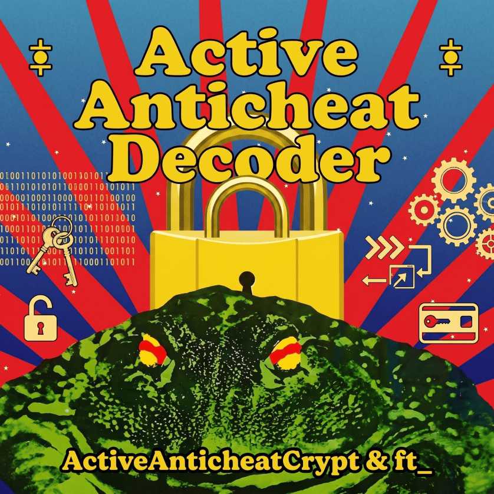

  

  
  
  

Some people are still selling decrypters for this AnTiChEaT system. It looks ridiculous, doesn't it? :)

### Features

- Decrypts ActiveAnticheatCrypt files from the client.
- Supports decrypting the MD5 hash manifest:  
`%TEMP%\ActiveAnticheat\<server_id>\ft_<server_id>.dat`
- Optionally decodes GamekitData after decryption into Lineage2Ver.

### Quick Start  
Just run the program and pick your client folder, or drag and drop it onto the `.exe`.

> [!NOTE]
> **Scryde Integration**  
> Check config.ini. By default, `scryde_gamekitdata_auto_decode = true`.  
Decrypting `ActiveAnticheatCrypt` automatically decodes `GamekitData` into `Lineage2Ver`.  
You can disable this in the configuration file if needed.

> [!IMPORTANT]
> **Standalone GamekitData decoding**  
> If you want to use the `GamekitData` decoder separately without `ActiveAnticheatDecoder`, check out [ScrydeEncDec](https://github.com/kerogenesis/ScrydeEncDec).

### Environment

Before building from source, make sure you have installed:

* **[Rust](https://www.rust-lang.org/tools/install)** (toolchain with `cargo`)
* **[Visual Studio](https://visualstudio.microsoft.com/)** (or **C++ Build Tools**) with the **"Desktop development with C++"** workload selected (required for MSVC linker).

### Building

Use `build_release.bat` script
